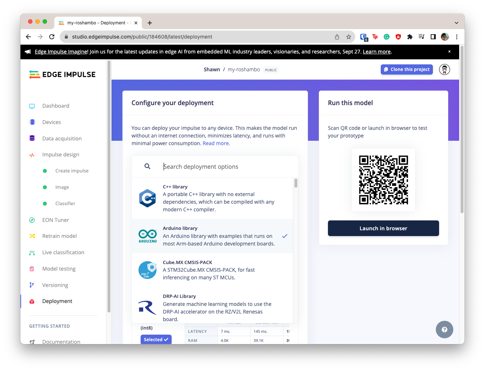

# Roshambo Image Classification Workshop

Welcome to the Roshambo workshop! We will build an image classification system that automatically identifies the rock, paper, scissors hand gestures on a low-power embedded system. Specifically, we will perform the following steps:

 1. [Capture raw data using the Arduino board](#01-data-capture)
 2. [Automatically generate new samples using data augmentation](#02-data-augmentation)
 3. [Train a convolutional neural network on the dataset using Edge Impulse](#03-model-training)
 4. (Optional) [Test inference locally on the Arduino using a static buffer](#04-optional-static-inference)
 5. [Perform live, continuous inference that identifies hand gestures in real time](#05-live-inference)
 6. (Optional) [Challenge! Flash LEDs based on inference results](#challenge)

> **Note**
> Helpful information will be highlighted in boxes like this. As the written documentatation and code for this workshop are all open source, you are welcome to use parts (or all) of this workshop to create your own course, workshop, etc. We just ask for [attribution](https://creativecommons.org/licenses/by-nc-sa/4.0/)!

## Required Hardware

This workshop is designed for the [Arduino Tiny Machine Learning Kit](https://store-usa.arduino.cc/products/arduino-tiny-machine-learning-kit).

If you do not have the kit, then you will need an [Arduino Nano 33 BLE Sense](https://store-usa.arduino.cc/products/arduino-nano-33-ble-sense) and an [OV7675 camera](https://www.arducam.com/products/camera-breakout-board/0-3mp-ov7675/). Connect the camera to the Arduino pins given at the top of [this sketch](01-data-capture/nano33_tinyml_kit_image_serial/nano33_tinyml_kit_image_serial.ino).

## Install Software

There are two options to doing the hands-on portion of this workshop: you can either run a virtual machine (VM) that has everything configured or install the toolchain manually on your host operating system.

### Virtual Machine (recommended)

Follow [these instructions](https://github.com/edgeimpulse/workshop-virtual-machine) to install VirtualBox and run the preconfigured virtuam machine.

### Local Installataion

If the VM does not work or you do not wish to install VirtualBox, you can install the toolchain locally.

Install the following programs:

 * [Arduino IDE](https://www.arduino.cc/en/software) (this workshop was tested with v2.0.3)
 * [Python](https://www.python.org/downloads/) (this workshop was tested with v3.10.2)

## Prerequisites

[Download this repository](https://github.com/edgeimpulse/workshop-arduino-tinyml-roshambo/archive/refs/heads/main.zip) as a .zip file. Unzip it somewhere on your computer (or VM).

You will also need a [Gmail account](https://accounts.google.com/SignUp) if you do not already have one in order to run Google Colab scripts.

## Introduction

Let's cover the basics of embedded machine learning and computer vision. Feel free to keep installing the required programs during the presentation!

1. [Workshop Intro](slides/workshop-intro.pptx?raw=true)
2. [Intro to Embedded ML](slides/intro-to-embedded-ml.pptx?raw=true)
3. [Intro to Computer Vision](slides/intro-to-computer-vision.pptx?raw=true)

## 01: Data Capture

Concept slides: 
1. [Overview of Digital Images](slides/overview-of-digital-images.pptx?raw=true)
2. [Image Classification](slides/image-classification.pptx?raw=true)

Almost every supervised machine learning project starts with some kind of dataset. Rather than using a pre-made dataset, we will create our own. This process provides hands-on experience working with raw data and demonstrates how bias might be introduced into machine learning models.

> **Note**
> The data we collect for this workshop will be just enough to build our quick demo. As a result, you can expect a model accuracy of only around 90%. For most production-ready models, you will need a LOT more data! Collecting quality data can be an expensive and time-consuming process. 

> **Note**
> Also, you are welcome to collect hand gestures other than rock, paper, and scissors. Just please keep it clean and under 5 target classes!

Open the Arduino IDE. Go to **Tools > Board > Boards Manager...**. Search for "nano 33" in the boards manager pane. Install the **Arduino Mbed OS Nano Boards** board package.


Go to **Sketch > Include Library > Add .ZIP Librar...**. Select **Arduino_OV767X.zip** file. This library is required for the Arduino Nano 33 BLE Sense to communicate with the camera on the TinyML kit.

Go to **File > Open...** and open the sketch **01-data-capture/nano33_tinyml_kit_image_serial/nano33_tinyml_kit_image_serial.ino**. Feel free to examine the code in the file to understand how images are captured, scaled, and cropped.

Make sure the Arduino board is plugged into your computer. Select **Tools > Board > Arduino Mbed OS Nano Boards > Arduino Nano 33 BLE**. Go to **Tools > Port** and select the associated port for your Arduino board. Select **Sketch > Upload** to compile and upload the program to your Arduino board.

You should see "Done" if your program uploaded successfully. You are welcome to open the Serial Monitor to see the base64 image data being sent from the Arduino. However, you must close the Serial Monitor when finished for the next part (i.e. you need to free the serial port).

Open a terminal window and navigate to this directory. For example:

```shell
cd Downloads/workshop-arduino-tinyml-roshambo/
```

Install the [PySerial](https://pyserial.readthedocs.io/en/latest/) and [Pillow](https://pillow.readthedocs.io/en/stable/) Python packages:

```shell
python -m pip install Pillow pyserial
```

Run the Serial Image Capture Python script:

```shell
serial-image-capture.py
```

Pay attention to the serial ports printed to the console! Copy the serial port location for your Arduino board. For example, this might be something like *COM7* on Windows or */dev/cu.usbmodem1442201* on macOS.


Paste that serial port location into the *Port* entry in the *Serial Image Capture* GUI. Make sure that the baud rate matches that found in the Arduino sketch (should be 230400 unless you changed it).

Press **Connect**. You should see a live view of the Arduino camera. Click *Embiggen view* to make the image bigger. Due to the slow nature of converting and transmitting raw image data over a serial connection, do not expect more than a few frames per second.

Enter "rock" for your first label. Hold your fist over the camera and ensure that you can see your whole hand in the viewer. Click **Save Image**. This will save the image shown in the viewer at the original resolution (default: 30x30, grayscale) in the directory you ran Python (e.g. this directory).


Repeat this process about 50 times. Each time, you should move your fist slightly (to help ensure the model is robust), but make sure your fist is fully visible in the viewer each time.

Repeat the data collection process for "paper" (hand flat out over the camera). Once again, ensure that your hand is almost entirely visible where possible. 


Do the same thing to gather around 50 images for "scissors" (index and middle finger making a 'V').


Next, we want to capture some background and unkown samples so that the model can tell that you are not giving one of the target hand gestures. Use the label "_background" and capture around 50 images of your background.


> **Note**
> We recommend using an underscore ('_') prefix to differentiate non-target labels. It makes reading labels a little easier in future steps, as Edge Impulse alphabetizes class labels.

Finally, set the label to "_unknown" and capture around 50 images of your hand performing different gestures that are clearly not one of "rock," "paper," or "scissors."


When you are done, exit out of the *Serial Image Capture* program (click the 'X' in the corner of the window like you would for any other application). Add all of your newly created images to a ZIP file named **dataset.zip**. If you are using macOS or Linux, you can accomplish this with the following command:

```shell
zip -FS -r dataset.zip *.png
```

> **Note**
> If you are unable to collect data for this project, you are welcome to use the dataset provided in this repository: [Arduino_OV767X.zip](Arduino_OV767X.zip?raw=true). Note that this dataset is unique to one hand and in one environment. It likely will not work as well for you, as your hands are different size/shape/color and in a different environment.

## 02: Data Augmentation

Concept slides:
1. [Data Augmentation](slides/data-augmentation.pptx?raw=true)
2. [Challenges in Computer Vision](slides/computer-vision-challenges.pptx?raw=true)

Most ML models (even the simple neural network we plan to use) require a lot of data to be even remotely accurate. We collected a relatively small amount of data. Real, original data is obviously the best, but for the sake of time, we will automatically generate new samples based on the data we collected. This technique is known as [Data Augmentation](https://en.wikipedia.org/wiki/Data_augmentation). 

We will use a Python script (Jupyter Notebook) in Google Colab. If you have not done so already, create a [Gmail account](https://accounts.google.com/SignUp).

Open the Notebook in [02-data-augmentation/ei-image-augmentation.ipynb](https://colab.research.google.com/github/edgeimpulse/workshop-arduino-tinyml-roshambo/blob/main/02-data-augmentation/ei-image-augmentation.ipynb).

Once the Notebook is open, run the first code cell (press **shift + enter** to run cells) to install Node.js. You might see a pop-up warning you that the Notebook is not authored by Google. Click **OK**.

While that cell is running, click on the *folder* icon on the left-side pane to open the file browser pane. Right-click (or click the *upload* icon) to upload a file to the Notebook. Select your **dataset.zip** and click **Open**. This will upload your original dataset.


Go to [edgeimpulse.com](https://edgeimpulse.com/). Create an account if you have not already done so. Click **Login** and click **Create new project**. Give your project a fun name, like "Roshambo Classifier."

Click on **Dashboard** and click on the **Keys** tab. Double-click to highlight the entire API key and copy it (don't worry if you can't see the whole key, it will be copied).


Head back to the Google Colab script. Continue running cells until you get to the `### Settings` cell. Overwrite the value of the `EI_API_KEY` string with the API key you copied from your project.


Continue running cells. The script performs the following actions:

 * Extracts your *dataset.zip* into the */content/dataset/* folder
 * Generates new images based on each original image: flipped, rotated, zoomed, translated, noise added
 * Zips the new dataset (including augmentations) into *out-augmented.zip* if you would like to download it
 * Uploads the full dataset to Edge Impulse, automatically splitting between training and test sets

> **Note**
> This Notebook contains a very basic set of image augmentation techniques. Take a look at each augmentation function to see how you might create even more images. We recommend reading through [this Survey on Image Data Augmentation for Deep Learning](https://journalofbigdata.springeropen.com/articles/10.1186/s40537-019-0197-0) to learn about other possible techniques. This is a great area for researchers and students to explore! How can you create robust models with as little data as possible?

If you head to the *Data acquisition* page in your Edge Impulse project, you should see your fully augmented dataset split between the *Training data* and *Test data* tabs. Note that some images might not be uploaded: Edge Impulse performs a deep inspection (via hashing) of each sample to ensure no two samples are the same. So, if you try to upload two images that are exactly the same, Edge Impulse will keep the first and reject the second.


## 03: Model Training

Concept slides:
1. [Review of Neural Networks](slides/review-of-neural-networks.pptx?raw=true)
2. [Image Convolution](slides/image-convolution.pptx?raw=true)
3. [Image Pooling](slides/image-pooling.pptx?raw=true)
4. [Convolutional Neural Networks](slides/convolutional-neural-networks.pptx?raw=true)

Go to your project in Edge Impulse. Go to the **Impulse design** page. Change the *Image data* resolution to be:

 * Image width: **30**
 * Image height: **30**
 * Resize mode: **Fit shortest**

Click **Add a processing block** and add the **Image** block. Click **Add a learning block** and select the **Classification** block.


Click on **Image** under *Impulse design*. Change the *Color depth* to **Grayscale**. 


Click **Save parameters** and click **Generate features** on the next page. Wait while Edge Impulse generates the training features from your dataset.

> **Note**
> Generating features for images simply means creating Numpy arrays from the raw image data in a common format that can be read by the training block. For other types of data, such as time series data, feature extraction might include a fast Fourier transform (FFT), spectrogram, statistical analysis (e.g. mean, skewness, and kurtosis), and so on. Feature extraction and engineering is another active area of research.

When feature extraction is complete, you should see a 2D feature explorer showing the relative separation among the class groupings along with an estimation of the time and resources required to perform feature extraction on your target device (default: Arm Cortex-M4F).


Click on **Classifier** under *Impulse design*. Change the *Number of training cycles* (epochs) to **100**. Leave everything else as default. Click **Start training**.

> **Note**
> The default Edge Impulse convolutional nerual network works great for simple image data (like the image set we are using). Feel free add/remove layers or modify existing layers to see if that affects your model accuracy! If you are comfortable with Python and Keras, you can click on the 3-dot menu and select *Switch to Keras (expert) mode* to modify the training code manually. Note that in order for your model to run on a microcontroller, you are limited to the [operations and layers available in TensorFlow Lite Micro](https://github.com/tensorflow/tflite-micro/blob/main/tensorflow/lite/micro/all_ops_resolver.cc).

When training is complete, take a look at the model results. Before the training process starts, Edge Impulse automatically sets aside a random 20% of your training data for validation. The accuracy, loss, and confusion matrix are calculated based on this validation set. How well did your model perform?


Go to the **Model testing** page and click **Classify all**. This will perform inference on your test dataset and display the results.


Navigate to the **Deployment** page in your project. Edge Impulse is capable of exporting your project (feature extraction and model inference) to a number of supported hardware platforms. Note that the *C++ library* option is the most versatile: so long as your target hardware has a C++ compiler (and enough flash/RAM), you can run inference with your trained Edge Impulse model! However, the C++ library may not be optimized for some hardware (e.g. ML accelerators).

Select the **Arduino library** option, as we'll be using Arduino to build our embedded project.



Scroll down to the bottom of the page. Leave the [EON Compiler](https://www.edgeimpulse.com/blog/introducing-eon) enabled (this converts your interpreted model to C++ code to save on flash/ROM). Leave *Quantized (int8)* selected. Click **Build**

> **Note**
> Quantization converts the floating point parameter values in a model to integer values (e.g. 8-bit integers). While this causes some reduction in accuracy, it allows for faster execution (especially on hardware without a [floating-point unit](https://en.wikipedia.org/wiki/Floating-point_unit)) and a smaller flash/RAM footprint for the model. Quantization is a crucial optimization for embedded ML, and it is a great place for exploration by researchers and students! [This paper](https://arxiv.org/abs/2103.13630) is a good starting place to learn more about quantization.


When the build process is complete, you should have an Arduino library (in .zip format) automatically downloaded to your computer. This library includes the blocks we created in the Edge Impulse Studio: feature extraction and classification (i.e. the fully trained model).

## 04: (Optional) Static Inference

It is often helpful to ensure that model inference executes in the same way you saw in a higher-level langauge (or, in our case, the Edge Impulse Studio). To accomplish this, we perform inference with a known-good sample in the Edge Impulse Studio and on our target hardware. We then compare the results to ensure they are the same (or close enough).

Open the Arduino IDE. Select **Sketch > Include Library > Add .ZIP Library**. Select the library that you downloaded from Edge Impulse and click **Open**.


Open **File > Examples > \<NAME_OF_LIBRARY\> > nano_ble33_sense > nano_ble33_sense_camera**. Feel free to look at this code, but we will be using something else for static inference. Copy the `#include` line for your library.


Open [04-static-inference/nano33_camera_static_inference/nano33_camera_static_inference.ino](https://github.com/edgeimpulse/courseware-embedded-machine-learning/blob/main/workshop-arduino-tinyml-roshambo/04-static-inference/nano33_camera_static_inference/nano33_camera_static_inference.ino?raw=true). Paste in the library include filename for the Edge Impulse library (this should match the one you copied from the example!).


Go back to your Edge Impulse project and navigate to **Model testing**. Find an example that did not achieve 100% accuracy, click the 3-dot menu on that sample, and select **Show classification**. This will open a new tab with the inference results for that one sample. Click the **Copy** button next to *Raw features*.


Paste these features into the `input_buf[]` array.


Upload the code to your Arduino. Note that this will take some time! For Windows users, this might take 15+ minutes (as Arduino does not multi-thread the compilation process on Windows). Expect the build process to take 5-10 minutes on other operating systems.

Once complete, open the *Serial Monitor* to view the inference results. They should be close to what you saw in the Edge Impulse Studio. Note that Edge Impulse uses the floating point version of the model when performing inference on the test set. Because we are using the quantized version, the confidence scores for the classes may be off by a few percentage points.


## 05: Live Inference

If you did not perform the static inference steps, you will need to import the Edge Impulse library. Open the Arduino IDE. Select **Sketch > Include Library > Add .ZIP Library**. Select the library that you downloaded from Edge Impulse and click **Open**.

Open **File > Examples > \<NAME_OF_LIBRARY\> > nano_ble33_sense > nano_ble33_sense_camera**. Copy the `#include` line for your library.

Open [05-live-inference/nano33_camera_live_inference/nano33_camera_live_inference.ino](https://github.com/edgeimpulse/courseware-embedded-machine-learning/blob/main/workshop-arduino-tinyml-roshambo/05-live-inference/nano33_camera_live_inference/nano33_camera_live_inference.ino?raw=true). Paste in the library include filename for the Edge Impulse library.


Upload the code to your Arduino board. Compiling the Edge Impulse library will likely take a while, so be patient. Once complete, run the Serial Image Capture script from a terminal:

```shell
python serial-image-capture.py
```

Paste in the port of your Arduino board and click **Connect**. The viewer will show you what the Arduino sees. Hold your hand over the camera and make the various gestures (e.g. rock, paper, scissors). Take a look at the terminal window--you should see the live inference results being printed!


The label with the highest score is the predicted class. As shown in the screenshot, "scissors" has a confidence score of 0.99219, meaning the model predicts that the input image likely belongs to the "scissors" class.

> **Note**
> You will probably notice that you need to hold your hand in a very specific position at a very specific distance from the camera. This is because we are working with a simple convolutional neural network that has little translation and rotation invariance. Data augmentation helped some, but it's far from perfect. Also, try pointing the camera away from its usual background (e.g. the ceiling). How does that change the inference results? Different lighting can drastically affect the functionality of computer vision applications!

## Challenge!

Now that you have live inference working, what can you do with it? For most embedded ML projects, you examine the inference results and perform some action based on the maximum predicted class. For example, if your simple smart camera identifies a "person," maybe it will turn on a light (a kind of "visual wake word").

Your challenge is to make one of the LEDs on the Arduino board light up whenever a hand gesture is recognized. Each gesture should correspond to a different LED. For example:

 * Red: "rock"
 * Green: "paper"
 * Blue: "scissors"

The LEDs should be off for any other class (e.g. "_background" and "_unknown"). One way to do this is to compare the confidence score values to a threshold. You can also simply identify the class with the highest score. [This tutorial](https://support.arduino.cc/hc/en-us/articles/360016724140-How-to-control-the-RGB-LED-and-Power-LED-of-the-Nano-33-BLE-boards-) demonstrates how to control the LEDs on the Nano 33 BLE Sense.

Need some hints?
* Look for the `// ***Challenge***` comment tags in *nano33_camera_live_inference.ino* to get some hints about where you might want to modify the code.
* You can use `ei_printf("some text\r\n")` to print strings to a terminal. This can help with debugging.
* Try running the demonstration code in [the tutorial listed above](https://support.arduino.cc/hc/en-us/articles/360016724140-How-to-control-the-RGB-LED-and-Power-LED-of-the-Nano-33-BLE-boards-) without adding any code: can you get the LEDs to blink?
* Read the demo code: note how `pinMode()` is used to configure the LEDs and `digitalWrite()` is used to control the LED state.
* Important! The RGB LED is "active low," which means you use `digitalWrite(RED, LOW)` to turn on the red LED.
* Modify the *live-inference* code in this repository to include LED controls. That means adding `pinMode()` function calls in `setup()` and calling `digitalWrite()` whenever a result score meets a particular threshold.
* Classification scores are stored in the `result.classification[i].value` variable. `result.classification[]` is an array where each element corresponds to a particular label (e.g. "rock," "_unknown").
* You can read more about the `ei_impulse_result_t` struct [here](https://docs.edgeimpulse.com/reference/c++-inference-sdk-library/structs/ei_impulse_result_t).

> **Note**
> Choosing an appropriate threshold can be tricky and depends on your use case. Higher thresholds (e.g. 70%) for a class reduce false positives, but you might miss some true positives (i.e. increased false negative rate). Lower thresholds (e.g. 30%) reduce false negatives but might introduce more false positives.

## Going Further

Image classification is a great introduction to computer vision, but it is just the beginning. Computer vision encompasses a wide variety of tasks, including object detection, image segmentation, pose estimation, optical character recognition (OCR), face recognition, etc. The following slides offer some additional information for these tasks:

1. [Intro to Object Detection](slides/intro-to-object-detection.pptx?raw=true)
2. [Intro to Image Segmentation](slides/intro-to-image-segmentation.pptx?raw=true)

Want some more information about embedded machine learning in the real world? Here are some projects and other examples:

1. [Embedded ML Applications](slides/embedded-ml-applications.pptx?raw=true)

## License

This tutorial (README.md) is licensed under [CC BY-NC-SA 4.0](https://creativecommons.org/licenses/by-nc-sa/4.0/).

Slides are licesned under [CC BY-NC-SA 4.0](https://creativecommons.org/licenses/by-nc-sa/4.0/).

Unless otherwise specified, code in this repository is licensed under the APACHE 2.0 open source license.

Copyright 2023 EdgeImpulse, Inc.

Licensed under the Apache License, Version 2.0 (the "License");
you may not use this file except in compliance with the License.
You may obtain a copy of the License at

[http://www.apache.org/licenses/LICENSE-2.0](http://www.apache.org/licenses/LICENSE-2.0)

Unless required by applicable law or agreed to in writing, software
distributed under the License is distributed on an "AS IS" BASIS,
WITHOUT WARRANTIES OR CONDITIONS OF ANY KIND, either express or implied.
See the License for the specific language governing permissions and
limitations under the License.